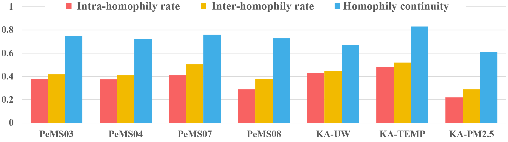
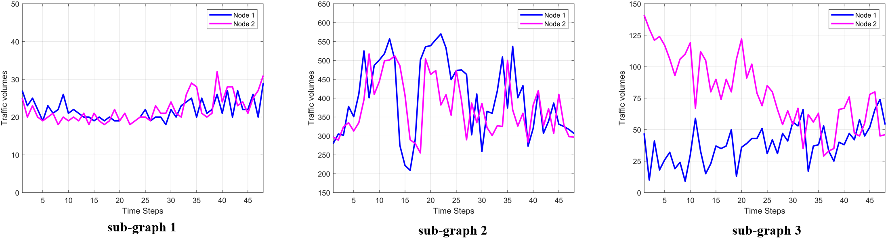

# [Designing Specialized Two-Dimensional Graph Spectral Filters for Spatial-Temporal Graph Modeling]

By: Yuxin Chen, Fangru Lin, Jingyi Huo, Hui yan

## Our paper has been accepted for publication of AAAI 2025 (acceptance rate 23.4%).

## Requirements

Our code is based on Python version 3.9.7 and PyTorch version 1.10.1. Please make sure you have installed Python and PyTorch correctly.

## Data 

Traffic: We utilize four widely studied traffic forecasting datasets: PeMS03, PeMS04, PeMS07, and PeMS08. PeMS stands for the Caltrans Performance Measurement System, which measures highway traffic in California in real-time every 30 seconds. All datasets are aggregated into 5-minute intervals, resulting in 288 data points per day. Download the data [STSGCN_data.tar.gz](https://pan.baidu.com/s/1ZPIiOM__r1TRlmY4YGlolw) with code: `p72z`. Since the spatial graphs for these datasets are constructed based on geographical distances, we maintain a low proportion of node connections by tuning the parameters $\sigma^{2}$ and $\epsilon$ (we set $\sigma^{2}=10$ and $\epsilon=0.1$ in this work). 

Climate: KnowAir documents weather observations every 3 hours, encompassing a dataset that spans from 2015 to 2018 and covers 184 major cities in China. We use three meteorological characteristics from the KnowAir dataset, including U wind components, urban temperature recordings, and PM2.5 concentrations, which we denote as KA-UW, KA-TEMP, and KA-PM2.5. Download dataset **KnowAir** from [Google Drive](https://drive.google.com/open?id=1R6hS5VAgjJQ_wu8i5qoLjIxY0BG7RD1L) or [Baiduyun](https://pan.baidu.com/s/18D6Etl5Lm1E4vOLVrX0ZAw) with code `t82d`.  We directly use the adjacency matrix provided in the dataset.

| Datasets   | Node | Interval | Time Range       | Time Steps |
|------------|------|----------|------------------|------------|
| PeMS03     | 358  | 5min     | 9/1/2018-11/30/2018 | 26208     |
| PeMS04     | 307  | 5min     | 1/1/2018-2/28/2018  | 16992     |
| PeMS07     | 883  | 5min     | 5/1/2017-8/31/2017  | 28224     |
| PeMS08     | 170  | 5min     | 7/1/2016-8/31/2016  | 17856     |
| KA-UW      | 184  | 3h       | 1/1/2015-12/31/2018 | 11688     |
| KA-TEMP    | 184  | 3h       | 1/1/2015-12/31/2018 | 11688     |
| KA-PM2.5   | 184  | 3h       | 1/1/2015-12/31/2018 | 11688     |

## Assortative Property Investigation
To further illustrate the characteristics of spatial-temporal signals across various datasets, we use feature similarity between nodes as a homophily measure to statistically analyze their assortative properties based on the constructed graphs. Specifically, we have defined the following indicators:

* Intra-homophily rate: probabilities of node pairs exhibiting similar observations at each time step.
* Inter-homophily rate: probabilities of node pairs exhibiting similar observations across adjacent time steps
* Homophily continuity: probabilities of node pairs maintaining close observations within adjacent time steps

Consequently, the assortative property investigation of seven datasets is presented in Figure below:

The statistics in the Figure suggest that diverse and dynamic node-wise correlations are ubiquitous across different spatial-temporal graph datasets. In summary, most prevailing GNN-based models, which focus on passing low-frequency information, are suboptimal for real-world dynamic systems.

## Construction of Coefficient Set
In this work, we incorporate both the spatial and temporal information of the input signal to adaptively generate the coefficients of Bernstein bases, thus achieving specialized 2-D spectral filtering for the input signal. For the spatial aspect, given the varying time intervals across different datasets, we employ different methods to capture time-related information. For traffic datasets, we concatenate two temporal features, i.e., time-of-day (1 to 288) and day-of-week (1 to 7), to form the temporal embedding. For climate datasets, considering that this dataset is not sensitive to the day of the week, we only adopt time-of-day (1 to 8) to form the temporal embedding.

## Details about variants V-OLP and V-SS
For variant V-OLP, we only adopt low-pass filtering for spatial-temporal signal process. To be specific, we set $\theta_{00} = 1$ and other $\theta_{pq}$ = 0 to achieve the low-pass filtering formulated as $\frac{1}{2^{P+Q}}(2I_{s}-L_{s})^{P}\times_{2}^{2}(2I_{t}-L_{t})^{Q}\times_{1}^{2}\mathcal{X}$.

For variant V-SS, we utilize a spatial graph based solely on pattern similarity. Specifically, we adopt Dynamic Time Warping (DTW) to calculate the pattern similarity between nodes and consequently build node connections.  We refer to (https://github.com/square-coder/STGODE) to construct a DTW-based matrix/.

## Construction of sub-graphs
We constructed sub-graphs with different spatial-temporal characteristics based on the PeMS04 dataset. For the first sub-graph, which exhibits high assortativity in both the spatial and temporal dimensions, we first applied the DTW algorithm to select a group of candidate node pairs and then chose pairs with smooth traffic flow fluctuations to construct the sub-graph. For the second sub-graph, we aimed to build a graph that exhibits high assortativity in the spatial dimension while showing disassortativity in the temporal dimension. To achieve this, we first used the DTW algorithm to select a group of candidate node pairs and then chose pairs with severe traffic flow fluctuations to construct the second sub-graph. For the final sub-graph, we randomly established connections between nodes with distinct spatial-temporal characteristics to create a graph that exhibits disassortativity in both the spatial and temporal dimensions. We controlled the number of nodes and edges in all sub-graphs at the same level to ensure the fairness of the experiment. Additionally, to better understand the node relationships within different sub-graphs, we selected a set of node pairs from each sub-graph and visualized their traffic flow variations. The visualization results are shown in the Figure below：

